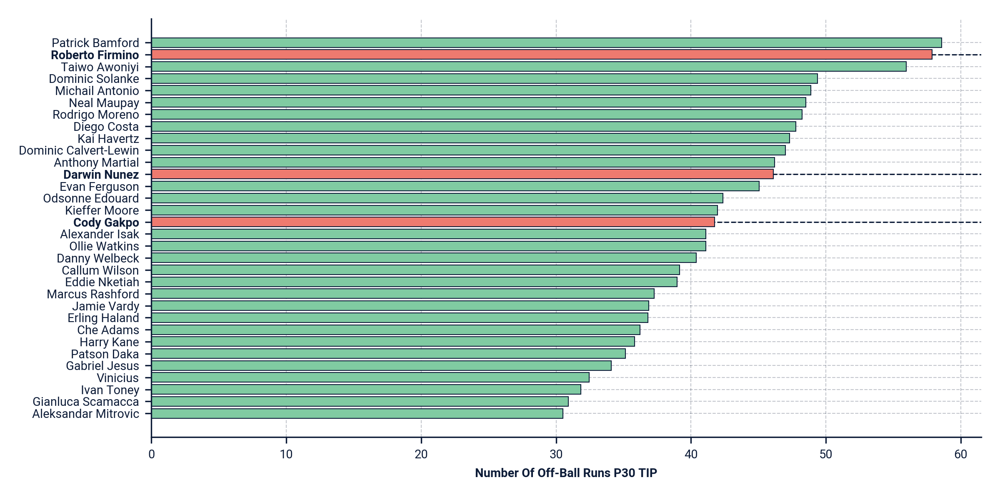
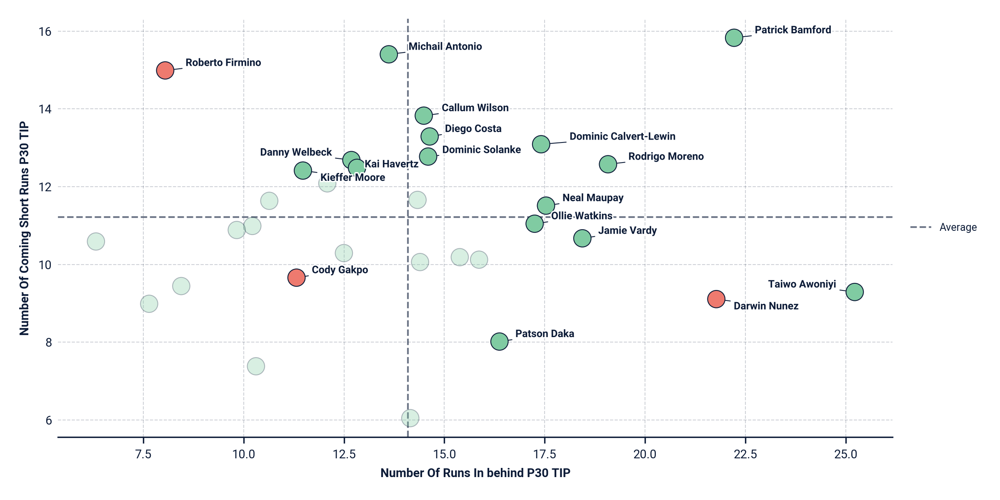
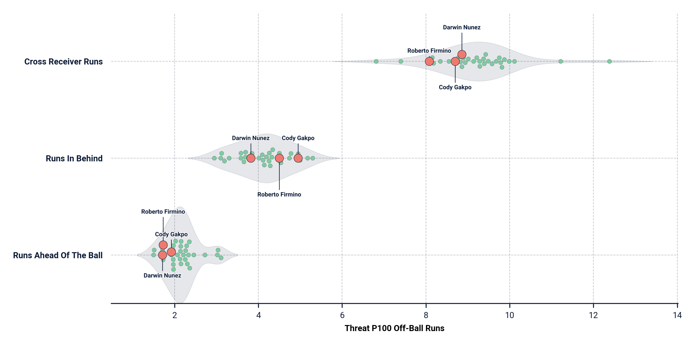

# SkillCorner Analysis Toolkit

The SkillCorner Analysis Toolkit is a Python package that provides functions to create standard visualizations frequently used by the SkillCorner data analysis team. It also includes functions to normalize SkillCorner data in various ways. This package is designed to streamline the data analysis process and facilitate the creation of insightful visualizations.

## Installation

You can install the SkillCorner Analysis Toolkit using pip. Simply run the following command:

```shell
pip install git+https://github.com/liamMichaelBailey/skillcorner_analysis_toolkit.git
```
## Getting Started

To start using the SkillCorner Analysis Toolkit, import the required functions and constants into your Python script or notebook:

```python
from skillcorner_analysis_toolkit.skillcorner_plots import plot_bar_chart, plot_scatter, plot_swarm_violin
from skillcorner_analysis_toolkit.skillcorner_normalisations import get_per_30_tip, get_per_100
from skillcorner_analysis_toolkit.constants import *
```

For a full example on using the package see the [sc_analysis_toolkit_examples notebook.](./sc_analysis_toolkit_examples.ipynb)
## Functions
### Visualization Functions
The SkillCorner Analysis Toolkit provides the following visualization functions:

- plot_bar_chart: Creates a bar chart visualization.
- plot_scatter: Creates a scatter plot visualization.
- plot_swarm_violin: Creates a swarm/violin plot visualization.

### Normalization Functions
The SkillCorner Analysis Toolkit provides the following normalization functions:

- get_per_90: Normalizes data to a per 90 minutes basis.
- get_per_30_tip: Normalizes data to a per 30 minutes of time in possession basis.
- get_per_100: Normalizes data to a per 100 actions basis.

## Plot Examples

### Bar Chart

### Scatter Plot

### Swarm/Violin Plot


## Contributing
If you encounter any issues, have suggestions, or would like to contribute to the SkillCorner Analysis Toolkit, please visit the GitHub repository. We welcome your contributions and appreciate your support in making this package even better.
